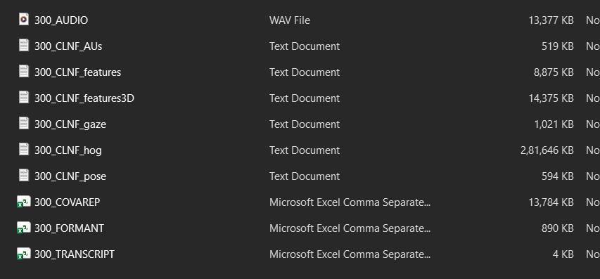

DAIC-‐‑WOZ Depression Database 
This database is part of a larger corpus, the Distress Analysis Interview Corpus (DAIC) (Gratch et 
al.,2014), that contains clinical interviews designed to support the diagnosis of psychological distress 
conditions such as anxiety, depression, and post-traumatic stress disorder. These interviews were 
collected as part of a larger effort to create a computer agent that interviews people and identifies 
verbal and nonverbal indicators of mental illness (DeVault et al., 2014). Data collected include audio and 
video recordings and extensive questionnaire responses; this part of the corpus includes the Wizard-of
Oz interviews, conducted by an animated virtual interviewer called Ellie, controlled by a human 
interviewer in another room. Data has been transcribed and annotated for a variety of verbal and non
verbal features.  
Data description 
The package includes 189 folders of sessions 300-492. Certain sessions have been excluded for technical 
reasons (see below). Data are grouped by session.  
Pack\ 
300_P 
301_P 
… 
492_P 
util 
documents 
train_split.csv 
dev_split.csv 
test_split.csv 
Excluded sessions: 342,394,398,460 
Included sessions with special notes: 
• 373 – there is an interruption around 5:52-7:00, the confederate enters the room to fix a minor 
technical issue, the session continuous and completes . 
• 444 – there is an interruption around 4:46-6:27, the participant’s phone rings and the 
confederate enters the room to help them turn it off. Session continuous and completes. 
• 451,458,480 – sessions are technically complete, but missing Ellie (the virtual human) part of the 
transcripts. Participant transcripts are still included, but without the interviewer questions. 
• 402 – video recording is cut ~2min before the end of the conversation. 
train_split_Depression_AVEC2017.csv: This file comprises participant IDs, PHQ8 (Kroenke et al., 20009) 
Binary labels (PHQ8 Scores >= 10), PHQ8 Scores, and participant gender, and single responses for every 
question of the PHQ8 questionnaire for the official train split. PHQ8 refers to the patient health 
questionnaire. Details are provided in the documentation folder file: scherer_etal2015_VowelSpace.pdf. 
dev_split_Depression_AVEC2017.csv: This file comprises participant IDs, PHQ8 Binary labels, PHQ8 
Scores, and participant gender, and single responses for every question of the PHQ8 questionnaire for 
the official development split. 
test_split_Depression_AVEC2017.csv: This file comprises participant IDs and participant gender for the 
official test split.  
Every session folder includes the following files (where XXX is session number, for example XXX=301 in 
folder 301_P). 
XXX_P\ 
XXX_CLNF_features.txt 
XXX_ CLNF _features3D.txt 
XXX_ CLNF _gaze.txt 
XXX_ CLNF _hog.bin 
XXX_ CLNF _pose.txt 
XXX_ CLNF _AUs.csv  
XXX_AUDIO.wav 
XXX_COVAREP.csv 
XXX_FORMANT.csv 
XXX_TRANSCRIPT.csv 
Utility files shared: 
util\ 
runHOGread_example.m 
Read_HOG_files.m  
File description and feature documentation 
This section documents the specific files that are shared for each session. Files that come from the same 
software are grouped by the software. 
1. CLNF framework output 
T. Baltrušaitis, P. Robinson, L-P. Morency. OpenFace: an open source facial behavior analysis 
toolkit in IEEE Winter Conference on Applications of Computer Vision (WACV), 2016 
(http://ieeexplore.ieee.org/abstract/document/7477553/)  
Link: https://github.com/TadasBaltrusaitis/OpenFace 
Files: 
• XXX.CLNF_features.txt:  
68 2D points on the face. The file format is as follows 
“frame, timestamp(seconds), confidence, detection_success, x0, x1,…, x67, y0, y1,…, 
y67”. Points are in pixel coordinates. 
• XXX_CLNF_AUs.csv : 
“frame, timestamp, confidence, success, AU01_r, AU02_r, AU04_r, AU05_r, AU06_r, 
AU09_r, AU10_r, AU12_r, AU14_r, AU15_r, AU17_r, AU20_r, AU25_r, AU26_r, AU04_c, 
AU12_c, AU15_c, AU23_c, AU28_c, AU45_c”. The values indicated with “_r” are 
regression outputs for each action unit and “_c” are binary labels reflecting 1 action unit 
is present or 0 not present. Action units: 
https://en.wikipedia.org/wiki/Facial_Action_Coding_System  
• XXX.CLNF_features3D.txt: 
68 3D points on the face. The file format is as follows 
“frame, timestamp(seconds), confidence, detection_success, X0, X1,…, X67, Y0, Y1,…, 
Y67, Z0, Z1,…, Z67”. The points are in millimeters in world coordinate space, with 
camera being at (0,0,0) and the axes aligned to the camera 
• XXX.CLNF_gaze.txt: 
“frame, timestamp(seconds), confidence, detection_success, x_0, y_0, z_0, x_1, y_1, z_1, 
x_h0, y_h0, z_h0, x_h1, y_h1, z_h1” 
The gaze is output as 4 vectors, first two vectors are in world coordinate space 
describing the gaze direction of both eyes, the second two vectors describe the gaze in 
head coordinate space (so if the eyes are rolled up, the vectors will indicate up even if 
the head is turned or tilted) 
• XXX.CLNF_hog.bin: 
HOG in a binary file format using the Felzenswalb's HoG on the aligned 112x112 area of 
the face. This results in a 4464 vector per frame. The way it is stored is a byte stream 
with every frame being: “num_cols, num_rows, num_channels, valid_frame, 4464d 
vector”. In the util folder there is a function “Read_HOG_files.m” from the CLM 
framework to read HOG binary format into a matlab matrix. 
• XXX.CLNF_pose.txt: 
“frame_number, timestamp(seconds), confidence, detection_success, X, Y, Z, Rx, Ry, Rz” 
Pose is an output of 6 numbers, X,Y,Z are the position coordinates and Rx,Ry,Rz the 
head rotation coordinates. Position is in world coordinates in millimeters and rotation is 
in radians and in Euler angle convention (to get to a proper rotation matrix the following 
is used R = Rx * Ry * Rz). 
All .txt files include the appropriate headers. Each line represents results for a frame. 
“Confidence” is a measure in [0,1] representing the confidence of the tracking. 
2. Audio file 
Audio file: XXX_AUDIO.wav (scrubbed) 
Audio recordings of head mounted microphone (Sennheiser HSP 4-EW-3) at 16kHz. Audio file 
might contain small amounts of bleed-over of virtual interviewer; use transcript files to alleviate 
this issue when processing. Identifiable utterances are scrubbed from the audio recordings, i.e. 
the waveform is zeroed out during the respective times; use transcript files and keyword 
“scrubbed_entry” to spot these instances. Scrubbed entries are also zeroed out in the feature 
files. 
3. Transcript file 
XXX_TRANSCRIPT.csv (scrubbed) 
Transcription conventions 
• Upper case words in the corpus but it is very rare. If they are present the upper case has 
no significance, except for it being a location name for example. 
• Incomplete words should are annotated as follows:  
If speech is cut-off, put down the complete intended word, followed by a comment with  
the part that was actually pronounced in angle brackets: people <peop>. The comment 
is just for human readers; the reason for transcribing a whole word is to avoid confusing 
the processing modules by training them on non-words. 
Unrecognizable words are indicated as ‘xxx’ 
Speech overlap is indicated by overlapping time stamps 
• Transcript files are “tab separated” files. 
• Transcriptions of virtual interviewer above Participant ID 363 were generated 
automatically and contain unique identifiers of utterances before the content of the 
utterance is provided in brackets.  
For example: 165.854 166.324 
Ellie yeah3 (yeah) 
Detailed transcription manual is provided in documents directory. 
4. Audio features 
Audio features are extracted using the COVAREP toolbox (v. 1.3.2) available at: 
https://github.com/covarep/covarep  
Files:  
• XXX_COVAREP.csv  (scrubbed): The following features are extracted: 
o All audio features (including Formants; see below) are every 10ms. Hence, the 
audio features are sampled at 100Hz.  
o F0, VUV, NAQ, QOQ, H1H2, PSP, MDQ, peakSlope, Rd, Rd_conf, MCEP_0-24, 
HMPDM_0-24, HMPDD_0-12 
o Descriptions for each of these features can be found on the COVAREP website 
and in the provided COVAREP publication. In addition, detailed information 
about the exact procedures of feature extraction are provided in the respective 
publications cited in the COVAREP scripts provided via github. 
o One important aspect is that VUV (voiced/unvoiced) provides a flag ({0,1}) if the 
current segment is voiced or unvoiced. In unvoiced case, i.e. VUV = 0, the vocal 
folds are detected to not be vibrating, hence values such as F0, NAQ, QOQ, 
H1H2, PSP, MDQ, peakSlope, and Rd should not be utilized. 
o Scrubbed entries are set to zeros. 
• XXX_FORMANT.csv (scrubbed): Contains the first 5 formants, i.e. the vocal tract 
resonance frequencies, that are tracked throughout the interview. 
o Scrubbed entries are set to zeros. 
References 
Jonathan Gratch, Ron Artstein, Gale Lucas, Giota Stratou, Stefan Scherer, Angela Nazarian, 
Rachel Wood, Jill Boberg, David DeVault, Stacy Marsella, David Traum, Skip Rizzo, Louis-Philippe 
Morency, “The Distress Analysis Interview Corpus of human and computer interviews”, 
Proceedings of Language Resources and Evaluation Conference (LREC), 2014 
DeVault, D., Artstein, R., Benn, G., Dey, T., Fast, E., Gainer, A., Georgila, K., Gratch, J., Hartholt, 
A., Lhommet, M., Lucas, G., Marsella, S., Morbini, F., Nazarian, A., Scherer, S., Stratou, G., Suri, 
A., Traum, D., Wood, R., Xu, Y., Rizzo, A., and Morency, L.-P. (2014). “SimSensei kiosk: A virtual 
human interviewer for healthcare decision support”. In Proceedings of the 13th International 
Conference on Autonomous Agents and Multiagent Systems (AAMAS’14), Paris 
Degottex, G.; Kane, J.; Drugman, T.; Raitio, T.; and Scherer, S., COVAREP - A collaborative voice 
analysis repository for speech technologies.  In Proceedings of IEEE International Conference on 
Acoustics, Speech and Signal Processing (ICASSP 2014), pages 960-964, 2014. 
Kroenke K, Strine TW, Spitzer RL, Williams JB, Berry JT, Mokdad AH. The PHQ-8 as a measure of 
current depression in the general population. Journal of affective disorders. 2009 Apr 
30;114(1):163-73.

// file to download
Index of /wwwdaicwoz
[ICO]	Name	Last modified	Size	Description
[PARENTDIR]	Parent Directory	 	-	 
[   ]	300_P.zip	2017-05-02 12:55	327M	 
[   ]	301_P.zip	2017-05-02 13:00	403M	 
[   ]	302_P.zip	2017-05-02 13:06	466M	 
[   ]	303_P.zip	2017-05-02 13:11	490M	 
[   ]	304_P.zip	2017-05-02 13:15	377M	 
[   ]	305_P.zip	2017-05-02 13:24	859M	 
[   ]	306_P.zip	2017-05-02 13:28	417M	 
[   ]	307_P.zip	2017-05-02 13:34	616M	 
[   ]	308_P.zip	2017-05-02 13:38	426M	 
[   ]	309_P.zip	2017-05-02 13:41	346M	 
[   ]	310_P.zip	2017-05-02 13:44	406M	 
[   ]	311_P.zip	2017-05-02 13:48	399M	 
[   ]	312_P.zip	2017-05-02 13:57	393M	 
[   ]	313_P.zip	2017-05-02 13:59	362M	 
[   ]	314_P.zip	2017-05-02 14:15	765M	 
[   ]	315_P.zip	2017-05-02 14:18	488M	 
[   ]	316_P.zip	2017-05-02 14:20	432M	 
[   ]	317_P.zip	2017-05-02 14:23	401M	 
[   ]	318_P.zip	2017-05-02 14:24	287M	 
[   ]	319_P.zip	2017-05-02 14:26	310M	 
[   ]	320_P.zip	2017-05-02 14:28	407M	 
[   ]	321_P.zip	2017-05-02 14:29	413M	 
[   ]	322_P.zip	2017-05-02 14:33	510M	 
[   ]	323_P.zip	2017-05-02 14:34	396M	 
[   ]	324_P.zip	2017-05-02 14:37	349M	 
[   ]	325_P.zip	2017-05-02 14:38	428M	 
[   ]	326_P.zip	2017-05-02 14:41	335M	 
[   ]	327_P.zip	2017-05-02 14:43	327M	 
[   ]	328_P.zip	2017-05-02 14:47	526M	 
[   ]	329_P.zip	2017-05-02 14:48	350M	 
[   ]	330_P.zip	2017-05-02 14:51	363M	 
[   ]	331_P.zip	2017-05-02 14:55	430M	 
[   ]	332_P.zip	2017-05-02 15:05	436M	 
[   ]	333_P.zip	2017-05-02 15:18	490M	 
[   ]	334_P.zip	2017-05-02 15:25	482M	 
[   ]	335_P.zip	2017-05-02 15:31	389M	 
[   ]	336_P.zip	2017-05-02 15:39	453M	 
[   ]	337_P.zip	2017-05-02 15:53	914M	 
[   ]	338_P.zip	2017-05-02 15:59	292M	 
[   ]	339_P.zip	2017-05-02 16:01	421M	 
[   ]	340_P.zip	2017-05-02 16:01	291M	 
[   ]	341_P.zip	2017-05-02 16:02	427M	 
[   ]	343_P.zip	2017-05-02 16:03	428M	 
[   ]	344_P.zip	2017-05-02 16:04	455M	 
[   ]	345_P.zip	2017-05-02 16:05	395M	 
[   ]	346_P.zip	2017-05-02 16:07	572M	 
[   ]	347_P.zip	2017-05-02 16:08	289M	 
[   ]	348_P.zip	2017-05-02 16:09	328M	 
[   ]	349_P.zip	2017-05-02 16:20	588M	 
[   ]	350_P.zip	2017-05-02 16:21	444M	 
[   ]	351_P.zip	2017-05-02 16:22	377M	 
[   ]	352_P.zip	2017-05-02 16:23	380M	 
[   ]	353_P.zip	2017-05-02 16:24	391M	 
[   ]	354_P.zip	2017-05-02 16:24	286M	 
[   ]	355_P.zip	2017-05-02 16:26	326M	 
[   ]	356_P.zip	2017-05-02 16:27	483M	 
[   ]	357_P.zip	2017-05-02 16:27	187M	 
[   ]	358_P.zip	2017-05-02 16:28	301M	 
[   ]	359_P.zip	2017-05-02 16:29	476M	 
[   ]	360_P.zip	2017-05-02 16:30	213M	 
[   ]	361_P.zip	2017-05-02 16:31	318M	 
[   ]	362_P.zip	2017-05-02 16:31	289M	 
[   ]	363_P.zip	2017-05-02 16:43	628M	 
[   ]	364_P.zip	2017-05-02 16:47	904M	 
[   ]	365_P.zip	2017-05-02 17:03	681M	 
[   ]	366_P.zip	2017-05-02 17:06	637M	 
[   ]	367_P.zip	2017-05-02 17:09	779M	 
[   ]	368_P.zip	2017-05-02 17:12	662M	 
[   ]	369_P.zip	2017-05-02 17:38	495M	 
[   ]	370_P.zip	2017-05-02 17:40	587M	 
[   ]	371_P.zip	2017-05-02 17:42	444M	 
[   ]	372_P.zip	2017-05-02 17:44	726M	 
[   ]	373_P.zip	2017-05-02 17:46	630M	 
[   ]	374_P.zip	2017-05-02 17:48	637M	 
[   ]	375_P.zip	2017-05-02 17:49	287M	 
[   ]	376_P.zip	2017-05-02 18:05	518M	 
[   ]	377_P.zip	2017-05-02 18:08	646M	 
[   ]	378_P.zip	2017-05-02 18:09	430M	 
[   ]	379_P.zip	2017-05-02 18:10	484M	 
[   ]	380_P.zip	2017-05-02 18:14	957M	 
[   ]	381_P.zip	2017-05-02 18:15	541M	 
[   ]	382_P.zip	2017-05-02 18:16	414M	 
[   ]	383_P.zip	2017-05-02 18:18	684M	 
[   ]	384_P.zip	2017-05-02 18:21	517M	 
[   ]	385_P.zip	2017-05-02 18:21	264M	 
[   ]	386_P.zip	2017-05-02 18:24	520M	 
[   ]	387_P.zip	2017-05-02 18:26	297M	 
[   ]	388_P.zip	2017-05-02 18:27	391M	 
[   ]	389_P.zip	2017-05-02 18:28	390M	 
[   ]	390_P.zip	2017-05-02 18:31	669M	 
[   ]	391_P.zip	2017-05-02 18:31	324M	 
[   ]	392_P.zip	2017-05-02 18:32	316M	 
[   ]	393_P.zip	2017-05-02 18:33	287M	 
[   ]	395_P.zip	2017-05-02 18:34	413M	 
[   ]	396_P.zip	2017-05-02 18:36	384M	 
[   ]	397_P.zip	2017-05-02 18:50	482M	 
[   ]	399_P.zip	2017-05-02 18:51	353M	 
[   ]	400_P.zip	2017-05-02 18:52	443M	 
[   ]	401_P.zip	2017-05-02 18:54	459M	 
[   ]	402_P.zip	2017-05-02 19:06	399M	 
[   ]	403_P.zip	2017-05-02 19:08	425M	 
[   ]	404_P.zip	2017-05-02 19:30	556M	 
[   ]	405_P.zip	2017-05-02 19:38	783M	 
[   ]	406_P.zip	2017-05-02 19:41	348M	 
[   ]	407_P.zip	2017-05-02 19:50	624M	 
[   ]	408_P.zip	2017-05-02 19:57	336M	 
[   ]	409_P.zip	2017-05-02 20:03	512M	 
[   ]	410_P.zip	2017-05-02 20:11	523M	 
[   ]	411_P.zip	2017-05-02 20:19	663M	 
[   ]	412_P.zip	2017-05-02 20:23	421M	 
[   ]	413_P.zip	2017-05-02 20:29	492M	 
[   ]	414_P.zip	2017-05-02 20:35	484M	 
[   ]	415_P.zip	2017-05-02 20:39	385M	 
[   ]	416_P.zip	2017-05-02 20:43	414M	 
[   ]	417_P.zip	2017-05-02 20:49	430M	 
[   ]	418_P.zip	2017-05-02 20:56	489M	 
[   ]	419_P.zip	2017-05-02 21:03	443M	 
[   ]	420_P.zip	2017-05-02 21:09	362M	 
[   ]	421_P.zip	2017-05-02 21:14	415M	 
[   ]	422_P.zip	2017-05-02 21:21	623M	 
[   ]	423_P.zip	2017-05-02 21:25	493M	 
[   ]	424_P.zip	2017-05-02 21:30	518M	 
[   ]	425_P.zip	2017-05-02 21:52	576M	 
[   ]	426_P.zip	2017-05-02 21:55	418M	 
[   ]	427_P.zip	2017-05-02 21:57	416M	 
[   ]	428_P.zip	2017-05-02 21:58	334M	 
[   ]	429_P.zip	2017-05-02 22:00	480M	 
[   ]	430_P.zip	2017-05-02 22:03	452M	 
[   ]	431_P.zip	2017-05-02 22:05	392M	 
[   ]	432_P.zip	2017-05-02 22:08	377M	 
[   ]	433_P.zip	2017-05-02 22:10	393M	 
[   ]	434_P.zip	2017-05-02 22:14	606M	 
[   ]	435_P.zip	2017-05-02 22:17	582M	 
[   ]	436_P.zip	2017-05-02 22:19	347M	 
[   ]	437_P.zip	2017-05-02 22:22	411M	 
[   ]	438_P.zip	2017-05-02 22:27	716M	 
[   ]	439_P.zip	2017-05-04 09:26	625M	 
[   ]	440_P.zip	2017-05-04 09:29	690M	 
[   ]	441_P.zip	2017-05-04 09:30	455M	 
[   ]	442_P.zip	2017-05-04 09:31	474M	 
[   ]	443_P.zip	2017-05-04 09:32	345M	 
[   ]	444_P.zip	2017-05-04 09:58	650M	 
[   ]	445_P.zip	2017-05-04 09:59	345M	 
[   ]	446_P.zip	2017-05-04 10:19	495M	 
[   ]	447_P.zip	2017-05-04 10:20	406M	 
[   ]	448_P.zip	2017-05-04 10:43	618M	 
[   ]	449_P.zip	2017-05-04 10:44	513M	 
[   ]	450_P.zip	2017-05-04 11:10	631M	 
[   ]	451_P.zip	2017-05-04 11:11	586M	 
[   ]	452_P.zip	2017-05-04 11:12	438M	 
[   ]	453_P.zip	2017-05-04 11:13	500M	 
[   ]	454_P.zip	2017-05-04 11:14	397M	 
[   ]	455_P.zip	2017-05-04 11:15	363M	 
[   ]	456_P.zip	2017-05-04 11:16	422M	 
[   ]	457_P.zip	2017-05-04 11:17	474M	 
[   ]	458_P.zip	2017-05-04 11:18	478M	 
[   ]	459_P.zip	2017-05-04 11:20	483M	 
[   ]	461_P.zip	2017-05-04 11:21	491M	 
[   ]	462_P.zip	2017-05-04 11:22	444M	 
[   ]	463_P.zip	2017-05-04 11:23	415M	 
[   ]	464_P.zip	2017-05-04 11:24	485M	 
[   ]	465_P.zip	2017-05-04 11:46	580M	 
[   ]	466_P.zip	2017-05-04 12:17	729M	 
[   ]	467_P.zip	2017-05-04 12:18	436M	 
[   ]	468_P.zip	2017-05-04 12:19	472M	 
[   ]	469_P.zip	2017-05-04 12:42	536M	 
[   ]	470_P.zip	2017-05-04 12:44	457M	 
[   ]	471_P.zip	2017-05-04 12:47	507M	 
[   ]	472_P.zip	2017-05-04 12:48	448M	 
[   ]	473_P.zip	2017-05-04 12:49	256M	 
[   ]	474_P.zip	2017-05-04 13:07	452M	 
[   ]	475_P.zip	2017-05-04 13:09	288M	 
[   ]	476_P.zip	2017-05-04 13:11	294M	 
[   ]	477_P.zip	2017-05-04 13:40	605M	 
[   ]	478_P.zip	2017-05-04 13:42	455M	 
[   ]	479_P.zip	2017-05-04 14:04	446M	 
[   ]	480_P.zip	2017-05-04 14:25	420M	 
[   ]	481_P.zip	2017-05-04 14:26	552M	 
[   ]	482_P.zip	2017-05-04 14:50	504M	 
[   ]	483_P.zip	2017-05-04 14:55	742M	 
[   ]	484_P.zip	2017-05-04 15:18	483M	 
[   ]	485_P.zip	2017-05-04 15:32	283M	 
[   ]	486_P.zip	2017-05-04 15:34	328M	 
[   ]	487_P.zip	2017-05-04 15:58	504M	 
[   ]	488_P.zip	2017-05-04 16:19	386M	 
[   ]	489_P.zip	2017-05-04 16:20	349M	 
[   ]	490_P.zip	2017-05-04 16:21	334M	 
[   ]	491_P.zip	2017-05-04 16:22	416M	 
[   ]	492_P.zip	2017-05-04 16:23	451M	 
[   ]	DAICWOZDepression_Documentation_AVEC2017.pdf	2017-05-05 16:30	92K	 
[TXT]	dev_split_Depression_AVEC2017.csv	2017-05-02 11:44	1.1K	 
[   ]	documents.zip	2016-03-30 16:05	5.8M	 
[TXT]	full_test_split.csv	2018-11-06 12:00	620	 
[TXT]	test_split_Depression_AVEC2017.csv	2016-03-09 10:54	304	 
[TXT]	train_split_Depression_AVEC2017.csv	2017-05-02 11:43	3.0K	 
[   ]	util.zip	2016-03-30 16:06	1.2K	 

 // FILES IN  one zip file 